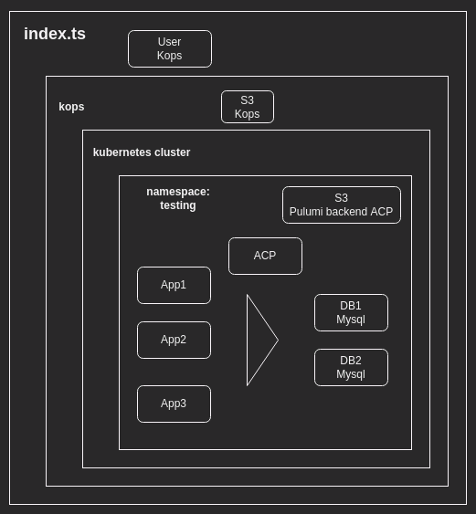
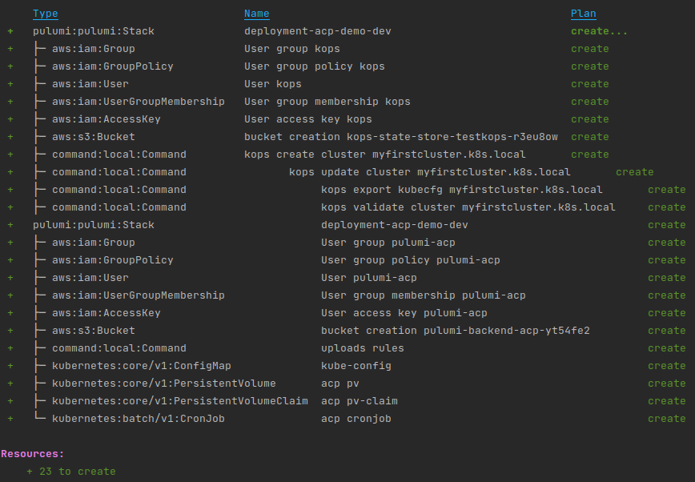

## Deployment - ACP Demo  

This implementation project aims to demonstrate the use of the ACP application designed to control permissions in Mysql databases, for this a scenario will be implemented as shown in the following image.

.

Components:
- creating the cluster with kops in aws
- creating the namespace and applications.
- 2 Mysql are implemented.
- ACP application is implemented.
- three applications that enter some tables and console print if it was successful or not.


To facilitate implementation, objects are modeled in classes, in index.ts an implementation example can be seen.

```
//create the namespace
const nameSpaceTest = new NameSpace("test", {app: "test"}, []);

//create the mysql app
const appMysqlServer1 = new Mysql("mysql1","5.6", "*", 3306, "2Gi", []);
const appMysqlServer2 = new Mysql("mysql2","5.6", "*", 3306, "2Gi", []);
const acp = new Acp("acp", "latest", 32000, []);

//add the app to the namespace
nameSpaceTest.addApplication(appMysqlServer1);
nameSpaceTest.addApplication(appMysqlServer2);
nameSpaceTest.addApplication(acp);

//create the cluster
const cluster = new Cluster(
    "myfirstcluster.k8s.local",
    "t3.medium",
    1,
    "us-east-1",
    "us-east-1a",
    "v1.21.1",
    "t3.medium",
    2
);

//add the namespace to the cluster
cluster.addNamespace(nameSpaceTest);

//Open ports for the cluster
//const openPort80 = new OpenPort("ingress", 80, "tcp", ["0.0.0.0/0"]);
//const openPort443 = new OpenPort("ingress", 443, "tcp", ["0.0.0.0/0"]);
//cluster.addNodeOpenPorts([openPort80, openPort443]);

//create the cluster in aws
const kops = new Kops(
    "TestKops",
    "us-east-1",
    [cluster]
);

```

.


